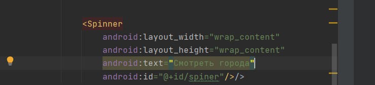
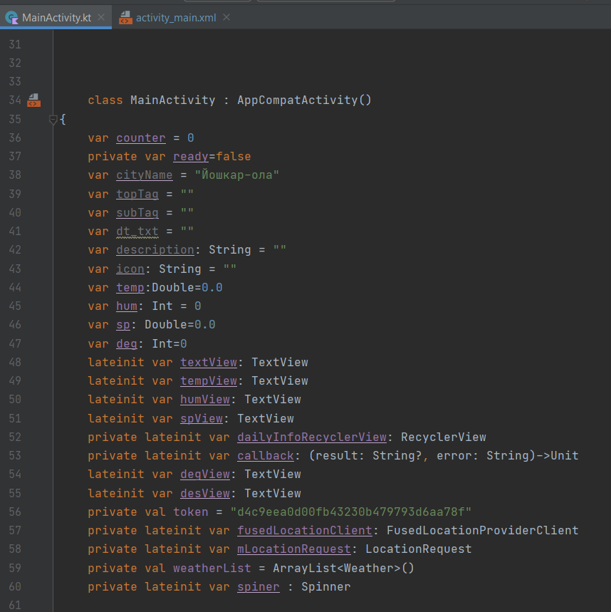
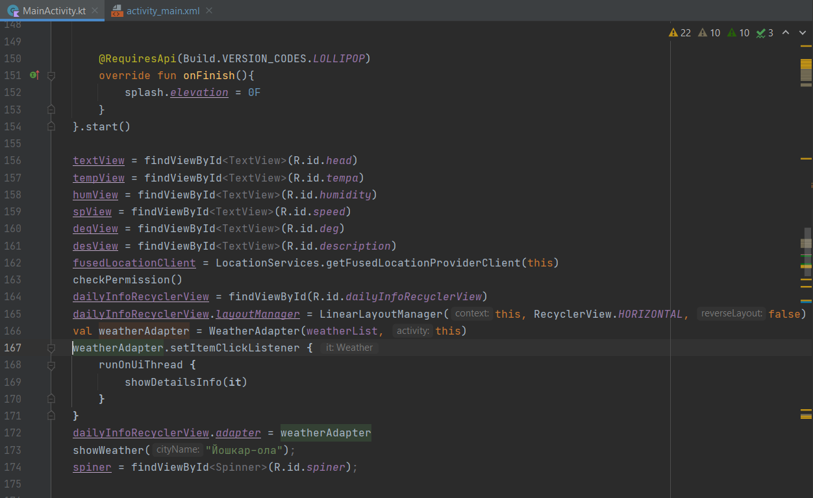
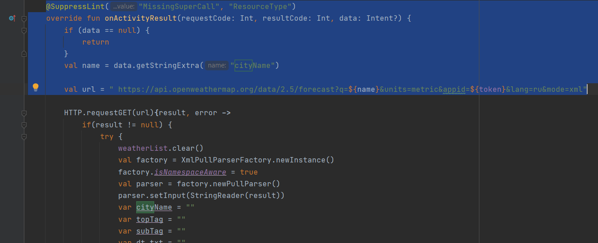

# Создание выпадающего списка Spinner
 
## Что такое Spinner
Спиннер позволяет быстро выбрать одно значение из набора. В состоянии по умолчанию счетчик показывает текущее выбранное значение. При касании счетчика отображается раскрывающееся меню со всеми другими доступными значениями, из которых пользователь может выбрать новое.

## Удаление Button 
Для начала нужно удалить Button(находится в activity_main.xml) и ее обработчик CityClick(находится в MainActivity)
## Разметка
Заходим activity_main.xml и создаем сам spinner на главном экране мобильного приложения:



android:layout_width - ширина элемента. Значение "match_content" указывает, что элемент будет растягиваться по ширине контента

android:layout_height - высота элемента. Значение "match_content" указывает, что элемент будет растягиваться по высоте контента

android:id - идентификатор элемента, через который мы сможем ссылаться на него в коде. В записи android:id="@+id/header" символ @ указывает XML-парсеру использовать оставшуюся часть строки атрибута как идентификатор. А знак + означает, что если для элемента не определен id со значением header, то его следует определить

## Создаем переменную spinner:


## Показываем и возвращаем Spinner
Далее чтобы вернуть наш Spinner  подобно остальным методам выше, вспомним для чего нам это было нужно:

Метод findViewById() возвращает объект класса View по его идентификатору на разметке (какой то из виджетов, например кнопку). Теперь, имея данный экземпляр виджета вы можете вызывать реализованные для него методы.

Для этого показываем город и возвращаем его:



## ArrayAdapter

ArrayAdapter является простейшим адаптером, который специально предназначен для работы с элементами списка типа ListView, Spinner, GridView и им подобным.

Заполняем наш элемент управления Spinner списком элементов с помощью ArrayAdapter.

Затем вам нужно указать реализацию интерфейса, вызвав setOnItemSelectedListener().

Когда пользователь выбирает элемент из раскрывающегося списка, Spinner объект получает событие on-item-selected.

Чтобы определить обработчик события выбора для счетчика, реализуем AdapterView.OnItemSelectedListenerинтерфейс и соответствующий onItemSelected()метод обратного вызова.

AdapterView.OnItemSelectedListenerТребует onItemSelected()и onNothingSelected()обратного вызова методов.

Метод onItemSelected слушателя OnItemSelectedListener получает четыре параметра:

*parent: объект Spinner, в котором произошло событие выбора элемента
*view: объект View внутри Spinnera, который представляет выбранный элемент
*position: индекс выбранного элемента в адаптере
*id: идентификатор строки того элемента, который был выбран

Это будет выглядеть так:
```
val adapter: ArrayAdapter<*> = ArrayAdapter.createFromResource(
            this, R.array.Citys,
            android.R.layout.simple_spinner_item
        )
        adapter.setDropDownViewResource(android.R.layout.simple_spinner_dropdown_item)
        spiner.setAdapter(adapter);
        spiner.onItemSelectedListener = object : AdapterView.OnItemSelectedListener{
            override fun onNothingSelected(parent: AdapterView<*>?) {}
            override fun onItemSelected(parent: AdapterView<*>?, view: View?, position: Int, id: Long) {
                showWeather(spiner.selectedItem.toString());
            }
        }

```

## Упрощаем

Этот код удаляем:


и вместо него пишем:
```
fun  showWeather(cityName : String){
        val url = " https://api.openweathermap.org/data/2.5/forecast?q=${cityName}&units=metric&appid=${token}&lang=ru&mode=xml"
```